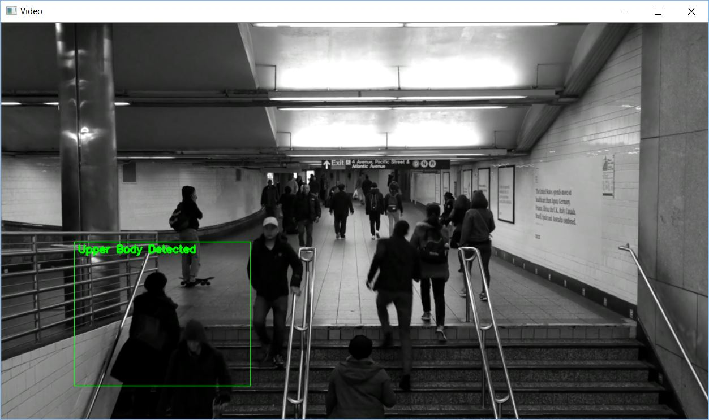
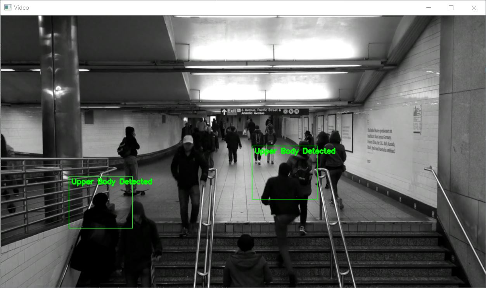

# Real-time Upper Body Detection
A Python script that detects human upper body in real-time.

## How It Works
Using OpenCV's upperbody Haar Cascade for positive human upper body detection from a video source or live webcam feed.
Whenever a positive is detected, it will highlight the detected positives with a green rectangular box,
human objects will be highlighted with multiple boxes when multiple positives detected.




## Dependencies
* [Python](https://www.python.org/downloads/)
* [OpenCV-Python](https://pypi.python.org/pypi/opencv-python) - Python API for OpenCV for all things computer vision
* [imutils](https://pypi.python.org/pypi/imutils) - A module for basic image processing

## Video Source
[Pexels Videos](https://videos.pexels.com/videos/black-and-white-footage-of-train-station-2655) - Black And White Footage Of Train Station

## Getting Started
### Prerequisites
Install all dependencies before moving on.

### Run the Script
To run the script just punch in
```
python real_time_upper_body_detection.py
```
Make necessary changes to the code to suit your needs.

## Acknowledgement
This is an open source project, you may replicate, modify or use the code as an extension to your own project.

As for the video,
you may copy, modify, distribute and perform the work, even for commercial purposes, all without asking permission.
